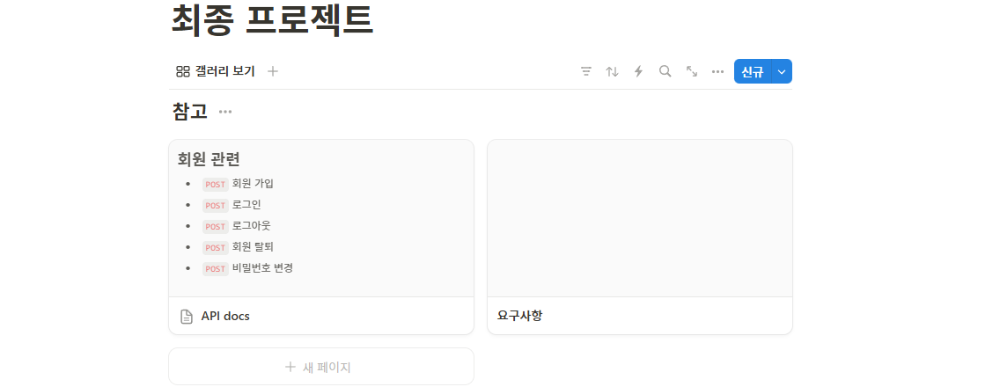
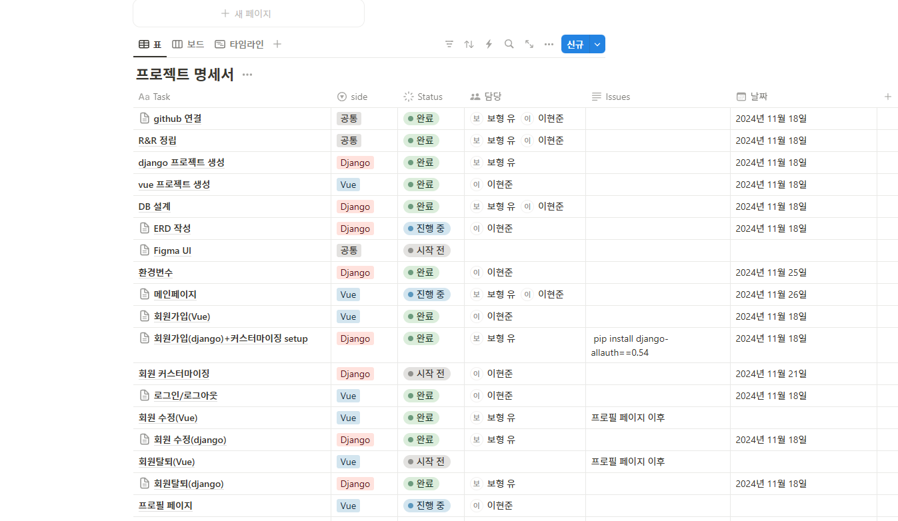
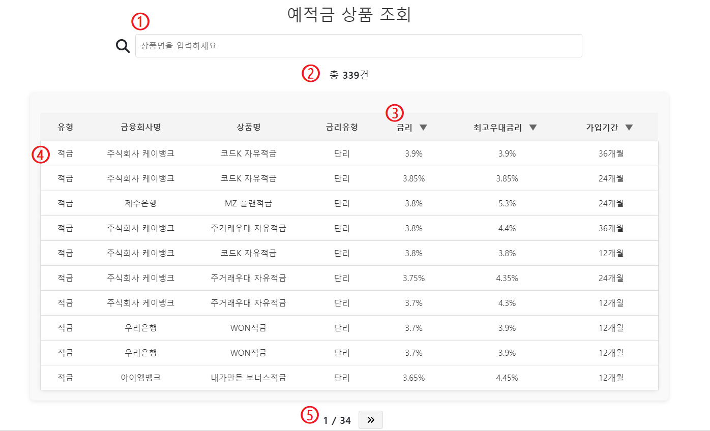

# SSAFY 12기 1학기 최종 프로젝트
## 개요
## 목차
- 팀원 정보 및 업무 분담 
- 절차
- 주요 기능
- 결과
- 느낀점

## 팀원 정보 및 업무 분담 내역
> 저희 팀은 프론트엔드, 백엔드의 뚜렷한 구분 없이 기능별로 역할을 분담했습니다. 
- 이현준(팀장)
  - `Vue` 스켈레톤 코드 작성
  - ERD 작성
  - 환율계산기
  - 근처 은행 검색
  - 게임 로직 설계, 구현
  - 회원가입, 로그인/로그아웃(프론트엔드)
  - 상품 추천 알고리즘 설계
  - 메인페이지, 네비게이션바
  - UI 통합
- 유보형(팀원)
  - 회원가입, 로그인/로그아웃(백엔드)
  - 예적금 데이터 조회
  - 게시판
  - 프로필 페이지
  - 상품 추천 알고리즘 구현
- 공통
  - 프로젝트 컨셉 도출 및 기획
  - R&R(Role & Responsibility) 정립
  - DB 설계
## 절차
### 프로젝트 기획

- `notion`으로 프로젝트 기획 및 추적 관리

### ERD
## 주요 기능
### 추천 알고리즘
- 사용자 정보를 기반으로 가중치를 구하고 가중치가 가장 높은 상품을 추천
  - 선택형 게임을 통해 사용자의 성향을 파악하고, 그에 따라 가중치 계산

#### 사용자 성향 파악

- 총 7개로 질문지를 구성하고, 선택에 해당하는 정보 저장
- 선택에 따라 사용자 정보를 각각 1점, 5점, 10점으로 구분

#### 정보의 우선순위 설정
- 사용자의 기본 신상정보, 수입 등 정량적 정보에 더 큰 가중치 부여
- 투자성향, 금융지식 등 정성적 정보에는 낮은 가중치 부여
- 동일한 틀 안에서는 사용자 점수가 클수록 가중치 부여
  - ex) `earn`(수입) 1점, `family`(가족구성원 수) 5점 => `family`에 더 큰 가중치 부여
- 이때의 가중치는 `1 - 우선순위 / 목록 수`로 계산
#### 사용자의 점수에 따른 가중치 부여 기준
> 상품의 필드값이 해당 기준에 가까울수록 높은 점수를 부여합니다.  
> 제한 없음 또는 기준 없음은 점수를 부여하지 않습니다.

- `earn`: 수입
  - 점수가 높을수록 수입이 많음
  - 1점: `가입기간` 6개월, `최고한도` 30만원
  - 5점: `가입기간` 12개월, `최고한도` 100만원
  - 10점: `가입기간` 제한 없음, `최고한도` 제한 없음
- `family`: 가족 구성원 수
  - 점수가 높을수록 가족 구성원 수가 많음
  - 1점: 기준 없음
  - 5점: 기준 없음
  - 10점: `우대조건`필드에 `자녀`가 포함
- `term`: 투자 기간 선호도
  - 점수가 높을수록 장기투자성향이 짙음
  - 1점: `가입기간` 12개월, `최고우대금리` 3%
  - 5점: `가입기간` 36개월, `최고우대금리` 4.25%
  - 10점: `가입기간` 제한 없음, `최고우대금리` 제한 없음
- `saving`: 소비패턴
  - 점수가 높을수록 소비가 평탄화(규칙적)
  - 1점: `적립유형(적금)`필드에 `자유`가 포함
  - 5점: 기준 없음
  - 10점: `적립유형(적금)`필드에 `정액`이 포함
- `patience`: 인내심
  - 점수가 높을수록 인내심이 높으며, 만기까지 상품을 보유할 가능성이 큼
  - 1점: 기준 없음
  - 5점: 기준 없음
  - 10점: `우대조건`필드에 `유지` 또는 `만기`가 포함
- `know`: 금융 지식
  - 점수가 높을수록 금융상품에 대한 이해도가 깊음
  - 1점: `금융상품설명`필드에 `자유`가 포함
  - 5점: 기준 없음
  - 10점: `금융상품설명`필드의 길이, `가입제한`, `우대조건`의 길이
- 금융상품 이해도가 높으면 상품설명, 가입제한 기준 및 우대조건을 면밀하게 확인 가능
#### 가중치 계산
- `min-max` 정규화
  > 금리의 경우 데이터의 범위가 0 ~ 100%, 가입기간은 1 ~ 36 등 데이터의 범위가 필드마다 상이하므로, 정규화 과정이 필요합니다.  
  > `min-max` 정규화는 데이터가 가질 수 있는 범위의 최소값과 최대값에서 데이터가 얼마나 떨어져 있는지를 계산하여 스케일을 조정하는 과정입니다.  
  - 상품의 각 필드값을 0과 1 사이의 값으로 정규화하여 계산  
    $$x_{normalized} = \frac{x - x_{min}}{x_{max} - x_{min}}$$  
  - 가중치 부여 기준 또한 정규화  
  $$\alpha_{normalized} = \frac{\alpha - x_{min}}{x_{max} - x_{min}}$$  
- 가중치 부여 기준으로부터 거리 계산  
$$d = abs(x_{normalized} - \alpha_{normalized})$$  
- 거리로부터 최종 점수 계산  
$$score_x = \sum_i^n\frac{1}{d_i + 1} * g_i$$  
- $score_x$: 상품 $x$의 최종 점수
- $n$: 필드 $i$의 개수
- $g_i$: 필드 $i$의 가중치
- 책정되는 점수는 설정한 기준으로부터의 거리 $d$에 반비례
- 거리가 `0`인 경우를 배제하기 위해 $d+1$을 분모로 설정
- 모든 필드에 대해 점수를 계산하여 상품의 최종 점수에 합산

#### 정렬
- 각 상품의 최종 점수를 내림차순 정렬하여 점수가 가장 높은 상품 하나를 추천
- `javascript` `sort()` 함수 사용
  
  

### 필수 기능
#### 메인페이지
- 서비스와 세부 기능의 간략한 소개글 제공
- JS 라이브러리 `Swiper`를 사용하여 슬라이더 생성
  - `coverflow` 효과와 `pagination`, `navigation` 모듈을 사용
  - `assets` 경로의 이미지 및 탬플릿 파일들을 가져옴
- 애니메이션 라이브러리인 `GSAP`를 사용하여 페이지 로드 시 텍스트 애니메이션을 적용
  - .headline-1과 .headline-2에 효과를 추가
- 웹 아이콘 라이브러리 `FontAwesome`을 사용하여 직관적인 아이콘 적용 
#### 회원 커스터마이징
- `allauth`, `dj-rest-auth` 라이브러리 사용
- `serializer`, `AccountAdapter` 커스터마이징
  - 회원가입 및 수정시 기본 필드 외 입력받을 필드 정의
  - 유효성 검사 후 데이터 저장
- 커스텀 필드
  - `age(Integer)`
  - `nickname(Char)`
  - `products(ManyToMany)`
    - 가입한 금융상품 목록
#### 예적금 금리 비교

1. 상품 조회
- `유형`, `금융회사명`, `상품명`, `금리유형` 필터링 기능 제공
2. 현재 제공되는 모든 상품 개수 출력
- `computed`를 활용해 필터링 후에도 재계산되도록 구현
3. `금리`, `최고우대금리`, `가입기간` 정렬 기능
- 토글로 구현해 내림차순, 오름차순 정렬 가능
4. 상품 상세 정보
- 각 상품을 클릭하면 상세페이지로 이동
- 찜 목록 추가 기능 구현
5. 페이지네이션
- `computed`를 활용해 필터링 후에도 재계산되도록 구현
#### 환율 계산기
- 수출입은행 오픈 `API` 데이터 활용
 - `apikey` 는 외부에 노출되면 안되므로 `.env`에서 관리 
 - `useCounterStore()`로 Vuex store를 가져오고, `store.getExchange()`를 통해 환율 데이터를 받아와 사용
 - `watch()`를 사용하여 환율 데이터가 변경될 때마다 `datas` 배열을 자동으로 업데이트
- 출발, 도착 통화 선택 후 변환
  - 단위 자동 출력
  - 입력값 검증 및 `alert`로 알림
- 순서 변경 기능 추가
  - 변환하고자 하는 두 통화가 같을 경우 사용자에게 `alert`로 알림
#### 근처 은행 검색
- `kakao map API` 활용
-  Django에서 `apikey` 환경변수 사용하기 위해 `django-environ` 패키지 설치
- `Pinia` 상태 관리 라이브러리를 사용하여 도시 및 은행 정보를 중앙 집중식으로 관리
- 기본적으로 근처에 있는 은행 목록을 핀으로 표시
- 특정 시/군/구의 근처 은행을 드롭다운에서 조회 가능
- 은행명으로 조회 가능
#### 커뮤니티
- 사용자들이 소통할 수 있는 게시판 기능 구현
- 게시글 생성, 수정, 삭제
  - 작성자만 수정, 삭제 가능
- 댓글 기능 구현
- 게시글 제목에 댓글 수 출력
#### 프로필 페이지
- 유저 정보 조회
- 회원정보 수정 페이지에서 수정 가능
- 유저가 가입한 상품 리스트 출력
  - 상품을 클릭하면 상세페이지로 이동
- `Chart.js`로 상품별 금리, 최고우대금리를 그래프로 보여줌
## 생성형 AI
- 적절한 프롬프트를 통해 게임 선택지 생성
- 상품목록 정렬의 비효율성 개선
  - 현재 페이지에서 출력할 상품의 목록 `products`는 반응형 데이터로 설정함
  - `products`를 정렬하는 과정에서 `products`를 참조하는 다른 `getters`의 정보가 업데이트되면서 느려지는 현상
  - `products`를 얕은 복사 후 복사한 배열을 정렬한 뒤 `products`의 값을 변경하여 해결

## 느낀점
이현준 : 1학기 관통 프로젝트는 Vue와 Django라는 기술 스택을 중심으로 진행되었고, 이는 기술적인 도전과 더불어 협업의 중요성을 체감하는 시간이었다. 구상한대로 구현하기 위해 많은 시간 검색을 하며 웹 개발을 위한 다양한 도구와 라이브러리가 있다는 것을 다시 한번 느낄 수 있었다.

